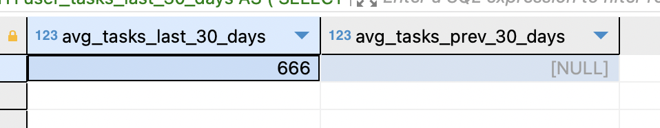
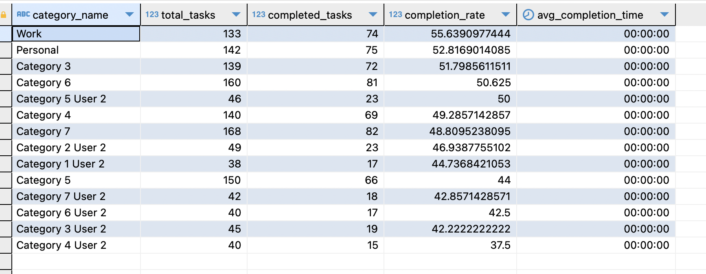
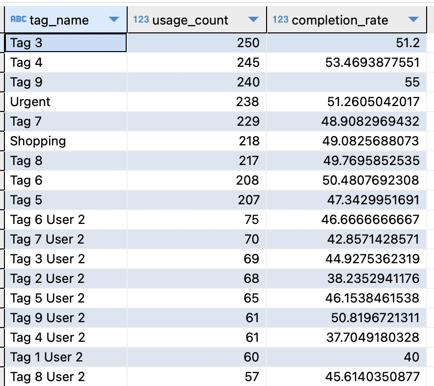

# Full-Stack Fracttal

This is a full-stack Fracttal application built with React (with Vite and Redux), Node.js, and PostgreSQL.

## Project Setup with Docker

**Note:** It is recommended to use the latest version of Docker to ensure compatibility with the Compose specification.

This project is configured to run with Docker Compose.

1.  **Build and run the services:**

    ```bash
    docker compose up -d --build
    ```

2.  **Access the application:**

    -   Frontend: [http://localhost:8070](http://localhost:8070)
    -   Backend: [http://localhost:3000](http://localhost:3000)

3.  **To stop the services:**

    ```bash
    docker compose down
    ```

## Manual Project Setup

### Database

To set up the PostgreSQL database manually, follow these steps:

1.  **Install PostgreSQL:** If you don\'t have it installed, you can download it from the official website: [https://www.postgresql.org/download/](https://www.postgresql.org/download/)

2.  **Create the database and user:**
    Open the PostgreSQL interactive terminal (`psql`) and run the following commands:

    ```sql
    CREATE DATABASE fracttal_db;
    CREATE USER fracttal_user WITH PASSWORD \'\'\'fracttal_password\'\'\';
    GRANT ALL PRIVILEGES ON DATABASE fracttal_db TO fracttal_user;
    ```

3.  **Connect to the new database:**
    You can connect to the database using the following command:

    ```bash
    psql -h localhost -U fracttal_user -d fracttal_db
    ```

4.  **Create the database schema and tables:**
    Once connected to the `fracttal_db` database, run the content of the `db/database.sql` file. This will create the necessary schema and tables.

    ```bash
    \i /path/to/your/project/db/database.sql
    ```
    *Replace `/path/to/your/project/` with the actual absolute path to the project\'s root directory.*


5.  **Populate the database with initial data:**
    After creating the tables, run the content of the `db/data.sql` file to populate the database with initial data.

    ```bash
    \i /path/to/your/project/db/data.sql
    ```
    *Replace `/path/to/your/project/` with the actual absolute path to the project\'s root directory.*

### Backend

1.  Navigate to the `backend` directory:
    ```bash
    cd backend
    ```
2.  Install the dependencies:
    ```bash
    npm install
    ```
3.  Create a `back.env` file in the root directory and add the following environment variables:
    ```
    DB_USER=fracttal_user
    DB_HOST=localhost
    DB_DATABASE=fracttal_db
    DB_PASSWORD=fracttal_password
    DB_PORT=5432
    JWT_SECRET=supersecret
    ALLOWED_ORIGINS=*
    ```
4.  Start the backend server:
    ```bash
    npm start
    ```

### Frontend

1.  Navigate to the `frontend` directory:
    ```bash
    cd frontend
    ```
2.  Install the dependencies:
    ```bash
    npm install
    ```
3.  Start the frontend development server:
    ```bash
    npm run dev
    ```

## Postman Collection

A Postman collection (`Postman_Collection.json`) has been provided in the root directory to help you test the backend API endpoints.

**How to use it:**

1.  **Import into Postman:** Open Postman, click on "Import" (usually in the top left corner), and select the `Postman_Collection.json` file.
2.  **Environment Variables:** You will need to set up an environment in Postman to manage variables like `YOUR_JWT_TOKEN`. After logging in (using the "Login User" request), copy the `token` from the response and set it as the value for `YOUR_JWT_TOKEN` in your Postman environment.
3.  **Replace Placeholders:** Remember to replace `YOUR_JWT_TOKEN` in the Authorization headers of protected requests with the actual JWT token obtained after a successful login. Also, replace `:id` in the URL paths for update and delete operations with actual IDs from your database.

## Business Intelligence Questions

The following are the business intelligence questions from the challenge, which can be answered by running SQL `db/queries.sql` queries against the database. Example images are attached; this could change on the execution date.

### 1. Análisis de Participación de Usuarios
**Pregunta:** ¿Cuál es el promedio de tareas creadas por usuario en los últimos 30 días, y cómo se compara con los 30 días anteriores?



### 2. Tendencias de Tasa de Completado
**Pregunta:** ¿Cuál es la tasa de completado diaria de tareas en los últimos 90 días, agrupada por nivel de prioridad?


### 3. Rendimiento por Categoría
**Pregunta:** ¿Qué categorías tienen las tasas de completado más altas y más bajas, y cuál es el tiempo promedio de completado para cada categoría?



### 4. Patrones de Productividad del Usuario
**Pregunta:** ¿Cuáles son las horas pico y días de la semana cuando los usuarios crean más tareas, y cuándo las completan?


### 5. Análisis de Tareas Vencidas
**Pregunta:** ¿Cuántas tareas están actualmente vencidas, agrupadas por usuario y categoría, y cuál es el promedio de días que están vencidas?


### 6. Estadísticas de Uso de Etiquetas
**Pregunta:** ¿Cuáles son las etiquetas más frecuentemente utilizadas, y qué etiquetas están asociadas con las tasas de completado más altas?



### 7. Métricas de Retención de Usuarios
**Pregunta:** ¿Cuántos usuarios han creado al menos una tarea en cada una de las últimas 4 semanas, y cuál es la tasa de retención semana a semana?


### 8. Análisis de Distribución de Prioridad
**Pregunta:** ¿Cuál es la distribución de tareas a través de los niveles de prioridad para usuarios activos (usuarios que han iniciado sesión en los últimos 7 días)?


### 9. Tendencias Estacionales
**Pregunta:** ¿Cómo varía la creación y completado de tareas por mes en el último año, y hay algún patrón estacional?


### 10. Benchmarking de Rendimiento
**Pregunta:** ¿Qué usuarios están en el 10% superior por tasa de completado de tareas, y cuál es el número promedio de tareas que manejan simultáneamente?

